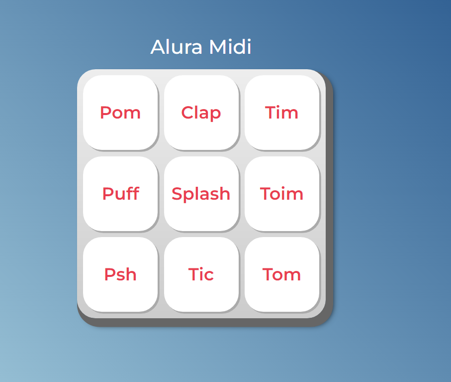

  

Alura midi - joguinho que toca sons desejados
,

## Onde encontrar?
- link: https://brunnasousa.github.io/aluramidi/

## Tecnologias
* HTML
* CSS
* JavaScript

## Como funciona?
- o usuario pode clicar ou pertar a tecla 'Enter' ou 'Space' do teclado que vai ser imitido um som como: Pom, Clap, Tim, Puff, Splash, Toim, Psh, Tic e Tom.
